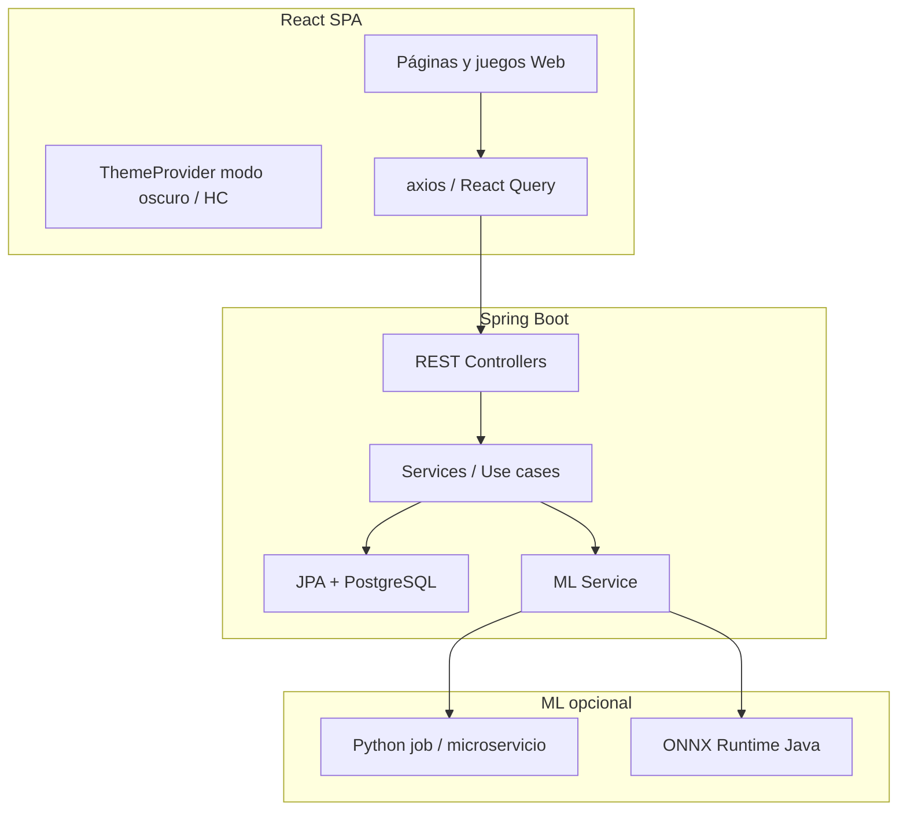

# EternaMente — Documentación para migración a Spring Boot + React

> **Objetivo:** Recrear el proyecto Android/Kotlin actual como aplicación web: **backend Java (Spring Boot)** + **frontend React**.  
> Este documento describe **todo** lo implementado hoy en el repo, con parámetros, atributos, flujos e interacciones, para que puedas portarlo sin adivinar.

**Versión fuente analizada:** código en `app/src/main/java/com/eternamente/app/` + `ml/`.

---

## Tabla de contenidos

1. [Visión general y arquitectura actual](#1-visión-general-y-arquitectura-actual)
2. [Arquitectura objetivo Spring Boot + React](#2-arquitectura-objetivo-spring-boot--react)
3. [Modelo de datos (entidades y atributos)](#3-modelo-de-datos-entidades-y-atributos)
4. [Machine Learning — pipeline completo](#4-machine-learning--pipeline-completo)
5. [Los 15 juegos cognitivos](#5-los-15-juegos-cognitivos)
6. [Casos de uso y reglas de negocio](#6-casos-de-uso-y-reglas-de-negocio)
7. [Navegación y flujos de pantalla](#7-navegación-y-flujos-de-pantalla)
8. [Tema, modo oscuro y accesibilidad](#8-tema-modo-oscuro-y-accesibilidad)
9. [Gamificación](#9-gamificación)
10. [Notificaciones, reportes y PDF](#10-notificaciones-reportes-y-pdf)
11. [Seguridad](#11-seguridad)
12. [API REST sugerida (Spring Boot)](#12-api-rest-sugerida-spring-boot)
13. [Estructura React sugerida](#13-estructura-react-sugerida)
14. [Inconsistencias conocidas del código actual](#14-inconsistencias-conocidas-del-código-actual)

---

## 1. Visión general y arquitectura actual

### Qué hace la app

- **Público:** adultos 55+ para cribado longitudinal de Deterioro Cognitivo Leve (DCL).
- **15 mini-juegos** que miden 6 dominios cognitivos.
- **ML on-device** (TensorFlow Lite + Isolation Forest en memoria) para alertas NORMAL / WATCH / ALERT.
- **Offline-first:** Room + SQLCipher local; Firebase Auth/FCM opcional.
- **Gamificación:** puntos, rachas, 14 badges.

### Capas Android (Clean Architecture + MVVM)

```
React (futuro)          ≈  presentation/ (Compose UI + ViewModels)
Spring Boot (futuro)    ≈  domain/ (use cases, modelos, ML)
                        ≈  data/ (repositorios, Room, Firebase)
Infra                   ≈  core/ (workers, PDF, notificaciones, crypto)
```

| Capa | Paquete | Responsabilidad |
|------|---------|-----------------|
| Presentation | `presentation/*` | UI Compose, ViewModels, navegación |
| Domain | `domain/*` | Use cases, modelos, `CognitiveAnalyzer`, gamificación |
| Data | `data/*` | Room DAOs, Firebase, implementaciones de repos |
| Core | `core/*` | WorkManager, PDF, AlarmManager, FCM |

---

## 2. Arquitectura objetivo Spring Boot + React

### Diagrama recomendado



### Decisiones de migración

| Android actual | Equivalente web |
|----------------|-----------------|
| Room + SQLCipher | PostgreSQL + cifrado en reposo (TDE) o columnas sensibles cifradas |
| DataStore prefs | `localStorage` + tabla `user_ui_preferences` en servidor |
| TFLite on-device | **Servidor:** cargar `eternamente_ml_v1.tflite` vía TensorFlow Java, **o** exportar ONNX y usar ONNX Runtime, **o** reentrenar y servir con scikit-learn/joblib en microservicio Python |
| Isolation Forest en RAM por usuario | Historial de vectores en BD + reentrenar periódicamente o usar modelo global |
| Compose Navigation | React Router v6 |
| Hilt DI | Spring `@Service` / `@Repository` |
| WorkManager semanal | `@Scheduled` (Spring) o Quartz |
| AlarmManager recordatorios | Web Push API + cron servidor (email opcional) |
| Biometría Android | WebAuthn (opcional) |
| PDF Canvas Android | iText / OpenPDF en servidor o `jspdf` en cliente |

### Privacidad

En Android **ningún dato cognitivo sale del dispositivo** (salvo Firebase Auth). En web debes **documentar** si el ML corre en servidor (datos viajan cifrados HTTPS) o si portas ML al navegador con **TensorFlow.js** (más parecido al original).

---

## 3. Modelo de datos (entidades y atributos)

### Enum: `CognitiveDomain`

```text
MEMORY, ATTENTION, EXECUTIVE, LANGUAGE, ORIENTATION, PROCESSING_SPEED
```

### Enum: `SessionType`

| Valor | Uso |
|-------|-----|
| `BASELINE` | Evaluación inicial (~6 juegos); establece baseline |
| `DAILY` | Sesión corta diaria (2–3 dominios); **default en MVP** |
| `WEEKLY_FULL` | Revisión semanal completa para ML |

### Enum: `AlertLevel`

```text
NORMAL, WATCH, ALERT
```

### Tabla `users`

| Campo | Tipo | Notas |
|-------|------|-------|
| `id` | UUID | PK |
| `email` | String | UNIQUE |
| `name` | String | |
| `age` | Int | |
| `educationYears` | Int | 6, 9, 12, 16 típicos |
| `gender` | String | M / F |
| `createdAt` | Instant | |
| `consentGivenAt` | Instant? | Consentimiento informado |

### Tabla `user_credentials`

| Campo | Tipo | Notas |
|-------|------|-------|
| `userId` | UUID | PK, FK → users |
| `pinHash` | String | PBKDF2-SHA256, Base64 |
| `pinSalt` | String | 32 bytes, Base64 |
| `failedLoginAttempts` | Int | Máx 5 |
| `lockedUntil` | Instant? | Bloqueo 30 min |

### Tabla `cognitive_sessions`

| Campo | Tipo | Notas |
|-------|------|-------|
| `id` | UUID | PK |
| `userId` | UUID | |
| `sessionDate` | LocalDate o Instant | |
| `durationSeconds` | Int? | |
| `type` | SessionType | |
| `completed` | Boolean | |

### Tabla `game_results` (métrica central)

| Campo | Tipo | Notas |
|-------|------|-------|
| `id` | UUID | PK |
| `sessionId` | UUID | FK → sessions, CASCADE |
| `userId` | UUID | Denormalizado |
| `gameId` | String | ej. `stroop` |
| `domain` | CognitiveDomain | |
| `scoreRaw` | Float | Escala depende del juego |
| `scoreNormalized` | Float | **0–100**, usado en ML y UI |
| `reactionTimeMsAvg` | Float | Media RT por estímulo |
| `reactionTimeMsP50` | Float | Mediana RT |
| `accuracyPct` | Float | 0–100 |
| `errorsCount` | Int | |
| `difficultyLevel` | Int | 1–5 al terminar |

> **Nota:** El KDoc menciona normalización por edad/educación; **no está implementada** — solo fórmulas por juego.

### Tabla `cognitive_baselines`

| Campo | Tipo |
|-------|------|
| `userId` | UUID PK |
| `memoryScore` | Float |
| `attentionScore` | Float |
| `executiveScore` | Float |
| `languageScore` | Float |
| `orientationScore` | Float |
| `overallScore` | Float |
| `calculatedAt` | Instant |

**No hay columna `processingSpeed`** en baseline.

### Tabla `ml_predictions`

| Campo | Tipo |
|-------|------|
| `id` | UUID |
| `userId` | UUID |
| `predictionDate` | Instant |
| `riskScore` | Float 0–1 |
| `alertLevel` | AlertLevel |
| `domainsFlagged` | String CSV: `MEMORY,ATTENTION` |
| `explanation` | String (español, lenguaje llano) |

### Tabla `gamification`

| Campo | Tipo |
|-------|------|
| `userId` | UUID PK |
| `totalPoints` | Int |
| `currentStreak` | Int |
| `maxStreak` | Int |
| `lastSessionDate` | String? ISO fecha |
| `badges` | String CSV de `Badge.name` |

### Tabla `user_settings` (cuenta)

| Campo | Tipo | Default |
|-------|------|---------|
| `userId` | UUID PK | |
| `notificationsEnabled` | Boolean | true |
| `notificationHour` | Int | 9 |
| `notificationMinute` | Int | 0 |
| `sessionFrequencyPerWeek` | Int | 1–7 |
| `language` | String | `es` |

### Preferencias UI (`UserPreferences` — DataStore en Android)

Equivalente React: `localStorage` + opcional sync servidor.

| Campo | Tipo | Default |
|-------|------|---------|
| `fontScale` | Float | 1.0 (0.85, 1.15, 1.30) |
| `highContrast` | Boolean | false |
| `hapticFeedback` | Boolean | true (vibración API web limitada) |
| `darkMode` | Boolean | false (**no sigue sistema por defecto**) |
| `onboardingCompleted` | Boolean | false |
| `currentUserId` | String? | |
| `isLoggedIn` | Boolean | false |
| `notificationsEnabled` | Boolean | true |
| `notificationHour` / `minute` | Int | 9:00 |
| `notificationUserName` | String | `"amigo"` |
| `reducedMotion` | Boolean | false |
| `talkBackMode` | Boolean | false |

---

## 4. Machine Learning — pipeline completo

### Resumen del flujo (producción: `CognitiveAnalyzer`)

```
game_results + cognitive_sessions (últimas 4 semanas)
        ↓
FeatureExtractor  → 14 features raw
        ↓
FeatureNormalizer → 14 features [0, 1]
        ↓
    ┌───┴───┐
    ↓       ↓
IsolationForest   TFLiteModelManager
(anomalía)        (riesgo 0–1)
    └───┬───┘
        ↓
determineAlertLevel + identifyFlaggedDomains
        ↓
AlertGenerator (texto ES) → MlPrediction
```

**Requisito:** `AnalyzeCognitivePatternUseCase` exige **≥ 3 sesiones completadas** antes de analizar.

**Programación:** `CognitiveAnalysisWorker` (WorkManager) cada **7 días**; también análisis manual desde reportes.

---

### Vector de 14 características (`FeatureVector`)

Orden **fijo** — debe coincidir con entrenamiento Python y entrada TFLite `[1, 14]`.

| Idx | Nombre | Descripción | Min | Max | Fallback |
|-----|--------|-------------|-----|-----|----------|
| 0 | `mean_rt_memory` | RT medio (ms) dominio MEMORY | 200 | 5000 | 0.5 |
| 1 | `mean_rt_attention` | RT medio ATTENTION | 200 | 5000 | 0.5 |
| 2 | `mean_rt_executive` | RT medio EXECUTIVE | 200 | 5000 | 0.5 |
| 3 | `mean_rt_language` | RT medio LANGUAGE | 200 | 5000 | 0.5 |
| 4 | `accuracy_memory` | Precisión % MEMORY | 0 | 100 | 0.5 |
| 5 | `accuracy_attention` | Precisión % ATTENTION | 0 | 100 | 0.5 |
| 6 | `accuracy_executive` | Precisión % EXECUTIVE | 0 | 100 | 0.5 |
| 7 | `accuracy_language` | Precisión % LANGUAGE | 0 | 100 | 0.5 |
| 8 | `accuracy_orientation` | Precisión % ORIENTATION | 0 | 100 | 0.5 |
| 9 | `trend_memory` | Pendiente OLS accuracy MEMORY | -10 | 10 | 0.5 si &lt; 3 puntos |
| 10 | `trend_attention` | Pendiente OLS accuracy ATTENTION | -10 | 10 | 0.5 si &lt; 3 puntos |
| 11 | `session_completion_rate` | Sesiones hechas / esperadas [0,1] | 0 | 1 | 0.5 |
| 12 | `rt_variability` | CV = std/mean de todos los RT | 0 | 1.5 | 0.5 si &lt; 3 RT |
| 13 | `delta_from_baseline` | Z-score reciente vs primeras sesiones | -3 | 3 | 0.5 |

**Ventana:** 4 semanas (`weeksBack = 4`).  
**Mínimo de datos:** `MIN_DATA_POINTS = 3` para tendencias, CV y delta.

#### Fórmula de normalización

```text
normalized[i] = clamp((raw[i] - MIN[i]) / (MAX[i] - MIN[i]), 0, 1)
```

Implementación Java (Spring):

```java
public float normalize(int index, float raw) {
    float lo = MIN[index], hi = MAX[index];
    if (hi == lo) return 0f;
    return Math.max(0f, Math.min(1f, (raw - lo) / (hi - lo)));
}
```

Arrays `MIN` y `MAX` en `FeatureNormalizer.kt` — **copiar exactamente** al portar.

---

### Isolation Forest (`IsolationForestModel`)

| Parámetro | Valor |
|-----------|-------|
| Árboles | 100 |
| Submuestra por árbol | 64 |
| Historial máximo | 200 vectores por usuario |
| Mínimo para entrenar | 10 muestras → si no, score **0.5** |
| Score | `2^(-avgPathLength / c(n))` en [0, 1] |

En Spring: mantener historial en tabla `user_feature_vectors` o recalcular desde `game_results`.

---

### TFLite (`TFLiteModelManager`)

| Propiedad | Valor |
|-----------|-------|
| Archivo | `app/src/main/res/raw/eternamente_ml_v1.tflite` |
| Input | `[1, 14]` float32 normalizado |
| Output | `[1, 1]` risk score 0–1 |
| Sin modelo | Fallback estadístico ponderado |

**Fallback estadístico** (pesos sobre features normalizadas):

- RT: 15%
- Accuracy: 35%
- Tendencia negativa: 20%
- Completion rate: 10%
- RT variability: 10%
- Baseline decline: 10%

---

### Reglas de alerta (`CognitiveAnalyzer`)

#### Dominios marcados (`identifyFlaggedDomains`) — sobre vector **normalizado**

| Dominio | Condición |
|---------|-----------|
| MEMORY | acc[4] &lt; 0.35 **o** RT[0] &gt; 0.70 **o** trend[9] &lt; 0.35 |
| ATTENTION | acc[5] &lt; 0.35 **o** RT[1] &gt; 0.70 **o** trend[10] &lt; 0.35 |
| EXECUTIVE | acc[6] &lt; 0.35 **o** RT[2] &gt; 0.70 |
| LANGUAGE | acc[7] &lt; 0.35 **o** RT[3] &gt; 0.70 |
| ORIENTATION | acc[8] &lt; 0.35 |

#### Nivel de alerta — usa **raw** feature[13] para declive

```text
declineSd = max(0, -deltaFromBaseline)   // z negativo = empeoramiento

ALERT  si: anomalyScore > 0.70
        o (declineSd > 1.5 Y flaggedDomains >= 2)

WATCH  si: anomalyScore >= 0.40
        o declineSd >= 1.0

NORMAL en otro caso
```

#### `combinedRiskScore` persistido

```text
(anomalyScore + tfliteRiskScore) / 2   // clamp [0, 1]
```

---

### Entrenamiento Python (`ml/`)

| Script | Función |
|--------|---------|
| `generate_synthetic_data.py` | 300 usuarios × 90 días; grupos NORMAL 60%, DCL_LEVE 25%, DCL_MODERADO 15% |
| `train_and_export_model.py` | Isolation Forest (solo NORMAL) + RandomForest 200 árboles + GridSearchCV + export TFLite INT8 |
| `generate_tflite.py` | TFLite desde PKL existente |

**Etiquetas sintéticas (Python):** WATCH ≥ 0.22, ALERT ≥ 0.45 — **no coinciden** con reglas Android en runtime (0.40 / 0.70).

**Métricas reportadas (README):** Accuracy ~97.8%, AUC ~0.997 (datos sintéticos).

**Distilación TFLite:** MLP 14→64→32→1 sigmoid; target = 0·P(NORMAL) + 0.5·P(WATCH) + 1·P(ALERT).

---

## 5. Los 15 juegos cognitivos

### Patrón de motor (`GameEngine`)

Estados: `Idle` → `Instructions` → `Countdown` → `Playing` → `Completed`.

Cada juego:

1. Recoge trials en `MetricsCollector` (RT, acierto, omisión).
2. Al terminar, `buildDomainResult()` crea `GameResult` para Room.
3. `SaveGameResultUseCase` + `UpdateGamificationUseCase`.

**`DifficultyManager`:** existe (niveles 1–5, umbrales 80%/50% accuracy) pero **no está conectado** a los motores en runtime — solo se pasa `difficultyLevel` por parámetro de navegación.

### Tabla resumen

| gameId | Nombre | Dominio | scoreRaw (idea) | scoreNormalized (fórmula) |
|--------|--------|---------|-----------------|---------------------------|
| `memory_match` | Memorama | MEMORY | puntos engine | 60% pares + 25% turnos + 15% tiempo |
| `digit_span` | Secuencia números | MEMORY | rondas correctas | 70% accuracy rondas + 30% span/7 |
| `corsi_block` | Corsi | MEMORY | max span | 70% rondas + 30% span/7 |
| `face_name` | Caras y nombres | MEMORY | recalls | correct/total × 100 |
| `prospective_memory` | Mem. prospectiva | MEMORY | hits | 70% hit rate + 30% (1-FP/5) |
| `flash_color` | Flash colores | ATTENTION | hits | 60% hits + 25% (1-FA) + 15% d′/3 |
| `spot_diff` | Diferencias | ATTENTION | encontradas | 80% ratio + 20% (1-falsos/10) |
| `trail_making` | Conecta puntos | EXECUTIVE | nodos | 70% completado + 20% errores + 10% RT* |
| `stroop` | Stroop | EXECUTIVE | aciertos | 70% acc + 30% (1-interferencia) |
| `clock_drawing` | Reloj | EXECUTIVE | 50/mano | 100 − error angular − 5×correcciones |
| `naming_image` | Nombra imagen | LANGUAGE | aciertos | correct/total × 100 |
| `verbal_fluency` | Fluencia | LANGUAGE | palabras/min | min(WPM/20×100, 100) |
| `reading_comprehension` | Lectura | LANGUAGE | aciertos | correct/total × 100 |
| `temporal_orientation` | Orientación | ORIENTATION | aciertos /5 | × 100 |
| `mental_calc` | Cálculo mental | PROCESSING_SPEED | aciertos | correct/total × 100 |

\* Trail making: el 10% de RT **aumenta** con RT más alto (comportamiento actual del código).

### Métricas persistidas (todas las partidas)

Siempre en `game_results`:

- `reactionTimeMsAvg`, `reactionTimeMsP50`
- `accuracyPct`, `errorsCount`
- `scoreRaw`, `scoreNormalized`, `difficultyLevel`

Métricas **solo en motor** (no en BD): d′, interferenceIndex, maxCorrectSpan, hits/misses detallados, etc.

### Sesión del día (MVP catálogo)

Juegos fijos “hoy”: `memory_match`, `stroop`, `temporal_orientation`, `verbal_fluency`, `digit_span`.

---

## 6. Casos de uso y reglas de negocio

| Use case | Entrada | Salida | Reglas |
|----------|---------|--------|--------|
| `RegisterUserUseCase` | name, email, pin, confirmPin | User | PIN 6 dígitos, PBKDF2, init gamification, guardar userId en prefs |
| `LoginUserUseCase` | email, pin | User | 5 intentos → bloqueo 30 min |
| `LogoutUseCase` | — | Unit | Limpia sesión prefs; **no borra** Room |
| `StartSessionUseCase` | userId, type, timestamp | CognitiveSession | Default `DAILY` |
| `SaveGameResultUseCase` | GameResult | GameResult | Valida scores 0–100 |
| `UpdateGamificationUseCase` | session, List&lt;GameResult&gt; | GamificationUpdate | Puntos + streak + badges |
| `AnalyzeCognitivePatternUseCase` | userId | MlPrediction | ≥ 3 sesiones; llama `CognitiveAnalyzer` |
| `GenerateReportUseCase` | userId | CognitiveReport | Últimos 50 results; baseline siempre null en código actual |

---

## 7. Navegación y flujos de pantalla

### Rutas (`Screen.kt`)

| Ruta | Pantalla |
|------|----------|
| `splash` | Splash |
| `onboarding/{step}` | Onboarding 4 pasos |
| `register` | Registro |
| `login` | Login PIN |
| `consent` | Consentimiento (placeholder; el real está en onboarding) |
| `dashboard` | Inicio |
| `game_catalog` | Catálogo 15 juegos |
| `game_instructions/{gameId}` | Instrucciones + crear sesión |
| `game_play/{gameId}/{sessionId}` | Juego |
| `game_result/{gameId}/{score}` | Resultado |
| `profile` | Perfil |
| `achievements` | Logros |
| `settings` | Ajustes |
| `accessibility_settings` | Accesibilidad |
| `weekly_report` | Reporte semanal |
| `monthly_report` | Reporte mensual |
| `pdf_export` | Exportar PDF |
| `alert_detail/{alertId}` | Detalle alerta ML |

### Bottom navigation

Inicio → Dashboard | Juegos → Catalog | Reportes → Weekly | Perfil → Profile

### Flujo de arranque

```text
MainActivity:
  Firebase user? → dashboard
  else → splash (1.2s + DataStore)

SplashViewModel:
  sin userId → register
  onboarding incompleto → onboarding
  user no en Room → register
  isLoggedIn → dashboard
  else → login
```

### Flujo de juego

```text
game_catalog → game_instructions/{id}
  → StartSessionUseCase(DAILY)
  → game_play/{id}/{sessionId}
  → al terminar: game_result/{id}/{score}
  → dashboard o play again (pop a catalog)
```

Salir a mitad de juego: diálogo confirmación → `score = 0`, **no guarda** en Room.

### Onboarding (4 pasos internos)

1. Bienvenida  
2. Perfil (nombre, edad, educación, género)  
3. Consentimiento (scroll + checkbox)  
4. Accesibilidad (fuente, contraste, háptica, oscuro) → `onboardingCompleted` → dashboard  

---

## 8. Tema, modo oscuro y accesibilidad

### Tokens de color (Material 3)

| Rol | Light | Dark |
|-----|-------|------|
| Primary | `#1565C0` (Blue40) | `#9ECAFF` (Blue80) |
| Secondary | `#2E7D32` | `#85C983` |
| Tertiary (alertas suaves) | `#F57F17` | `#FFB74D` |
| Error | `#C62828` | `#FF8A8A` |
| Background | `#FAFAFA` | `#1A1C1E` |
| Surface | `#FFFFFF` | `#1A1C1E` |

### Modo oscuro

- Controlado por `UserPreferences.darkMode` (**toggle manual**, default `false`).
- En React: `ThemeProvider` con palette light/dark + persistencia `localStorage.darkMode`.
- **No** usa `prefers-color-scheme` por defecto (puedes añadir opción “seguir sistema”).

### Alto contraste

4 esquemas: light, dark, HC light, HC dark (`PureBlack` / `PureWhite` fondos).

React: duplicar tokens CSS variables `--color-primary`, etc.

### Tipografía

- Fuente prevista: **Nunito** (en Android aún `SansSerif` placeholder).
- `bodyLarge` 18sp mínimo; labels ≥ 16sp.
- `fontScale`: 0.85 | 1.0 | 1.15 | 1.30 — aplicar `font-size: calc(base * var(--font-scale))`.

### Accesibilidad funcional

| Opción | Efecto |
|--------|--------|
| `highContrast` | Paleta HC |
| `darkMode` | Tema oscuro |
| Texto grande (settings) | 1.0 ↔ 1.15 |
| `reducedMotion` | Desactiva animaciones (flip cartas, transiciones) |
| `hapticFeedback` | Vibración en aciertos/errores (`navigator.vibrate`) |
| `talkBackMode` | Textos ARIA extendidos; Trail Making y Reloj limitados |

### Transiciones UI

- Auth/reportes/perfil: fade 300ms  
- Juegos: slide horizontal 280ms  

React: `framer-motion` con `reducedMotion` respetando `prefers-reduced-motion` y flag usuario.

---

## 9. Gamificación

### Puntos por partida

```text
base = accuracyPct × 10
speedBonus = +20 si RT_avg < 800ms, +10 si < 1500ms
multiplier = 1 + min(streak, 7) × 0.1   // máx 1.7×
points = max(1, floor((base + speedBonus) × multiplier))
```

### Rachas

- Mismo día: no incrementa (`AlreadyDone`).
- Día anterior: `streak + 1`.
- Hueco &gt; 1 día: reinicia a 1.

### Badges (`Badge` enum)

| Badge | Condición |
|-------|-----------|
| FIRST_STEP | ≥ 1 sesión completada |
| WEEK_WARRIOR | streak ≥ 7 |
| CONSISTENT | streak ≥ 14 |
| CONSISTENCY_MASTER | streak ≥ 30 |
| MEMORY_ACE | ≥ 3 juegos memoria con accuracy ≥ 90% |
| ATTENTION_CHAMPION | ≥ 1 juego atención ≥ 90% |
| DOMAIN_EXPLORER | jugó los 6 dominios |
| LEVEL_MAX | difficulty ≥ 5 |
| SPEED_DEMON | flash_color min RT &lt; 500ms |
| FULL_SPRINT | sesión BASELINE o WEEKLY_FULL |
| COMEBACK | gap ≥ 7 días y ≥ 2 sesiones totales |
| FIRST_REPORT | ≥ 1 reporte generado |
| EARLY_ADOPTER | Solo UI 100%; **sin unlock en engine** |

---

## 10. Notificaciones, reportes y PDF

### Canales

| ID | Uso |
|----|-----|
| `daily_reminder` | Recordatorio sesión → game_catalog |
| `cognitive_alert` | Alerta ML WATCH/ALERT |
| `achievement` | Badge nuevo (baja prioridad) |

### Worker ML

- Periódico cada **7 días**, requiere ≥ **7 sesiones**.
- Notifica solo WATCH/ALERT.
- Cancelar al logout.

### PDF (5 páginas)

1. Portada  
2. Resumen dominios vs baseline  
3. Gráficas barras + línea 8 semanas  
4. Mensaje IA / explicación  
5. Contacto + disclaimer  

Datos: `PdfReportData` (userName, age, weekRange, domainScores, baseline, trend, latest MlPrediction).

React: generar en servidor (OpenPDF) o cliente (`jspdf` + `chart.js`).

---

## 11. Seguridad

| Medida | Implementación actual | Spring/React |
|--------|----------------------|--------------|
| PIN | PBKDF2-HMAC-SHA256, 100k iter, salt 32B | `PasswordEncoder` custom o BCrypt solo si abandonas PIN 6 dígitos |
| BD local | SQLCipher AES-256 | HTTPS + PostgreSQL + cifrado disco |
| Clave DB | Android Keystore | Vault / KMS |
| Bloqueo | 5 intentos, 30 min | Misma lógica en `user_credentials` |
| Firebase | Email + PIN como password MVP | JWT propio o OAuth2 |
| Red | Solo HTTPS | Spring Security + CORS |

---

## 12. API REST sugerida (Spring Boot)

### Auth

```http
POST   /api/v1/auth/register     { name, email, pin, age, educationYears, gender }
POST   /api/v1/auth/login        { email, pin }
POST   /api/v1/auth/logout
GET    /api/v1/auth/me
```

### Sesiones y juegos

```http
POST   /api/v1/sessions          { type: "DAILY" }
PATCH  /api/v1/sessions/{id}     { completed: true, durationSeconds }
POST   /api/v1/sessions/{id}/results   GameResultDto (cuerpo completo)
GET    /api/v1/games             lista ALL_GAME_DEFINITIONS
GET    /api/v1/games/{gameId}/history?limit=20
```

### ML y reportes

```http
POST   /api/v1/users/me/analysis          → MlPredictionDto
GET    /api/v1/users/me/predictions?limit=10
GET    /api/v1/users/me/reports/weekly
GET    /api/v1/users/me/reports/monthly
GET    /api/v1/users/me/reports/pdf         → application/pdf
```

### Gamificación y preferencias

```http
GET    /api/v1/users/me/gamification
GET    /api/v1/users/me/badges
PUT    /api/v1/users/me/settings          UserSettingsDto
PUT    /api/v1/users/me/ui-preferences    UserPreferencesDto
```

### DTO ejemplo `GameResultDto`

```json
{
  "sessionId": "uuid",
  "gameId": "stroop",
  "domain": "EXECUTIVE",
  "scoreRaw": 18,
  "scoreNormalized": 87.5,
  "reactionTimeMsAvg": 1240.5,
  "reactionTimeMsP50": 1180,
  "accuracyPct": 90,
  "errorsCount": 2,
  "difficultyLevel": 2
}
```

### Servicio ML en Spring (pseudocódigo)

```java
@Service
public class CognitiveAnalysisService {
  public MlPrediction analyze(UUID userId) {
    FeatureVector raw = featureExtractor.extract(userId, 4);
    FeatureVector norm = normalizer.normalize(raw);
    float anomaly = isolationForest.score(userId, norm);
    float risk = tfliteRunner.predict(norm.getNormalized());
    AlertLevel level = alertPolicy.decide(anomaly, raw, norm);
    return repository.save(...);
  }
}
```

---

## 13. Estructura React sugerida

```text
src/
├── api/              # axios clients
├── theme/
│   ├── tokens.ts     # colores Color.kt
│   ├── light.ts
│   ├── dark.ts
│   ├── highContrast.ts
│   └── ThemeProvider.tsx
├── routes/
│   ├── AppRouter.tsx
│   └── guards/       # AuthGuard, OnboardingGuard
├── pages/
│   ├── auth/
│   ├── onboarding/
│   ├── dashboard/
│   ├── games/
│   │   ├── catalog/
│   │   ├── instructions/
│   │   ├── play/     # GameRouter por gameId
│   │   └── result/
│   ├── reports/
│   └── profile/
├── games/            # 15 implementaciones
│   ├── memoryMatch/
│   ├── digitSpan/
│   └── ...
├── hooks/
│   ├── usePreferences.ts
│   └── useSession.ts
└── types/            # espejo de domain/model
```

### Librerías recomendadas

| Necesidad | Librería |
|-----------|----------|
| UI | MUI 6 o Chakra (theming built-in) |
| Estado servidor | TanStack Query |
| Formularios | React Hook Form + Zod |
| Gráficas reportes | Recharts |
| Juegos canvas | Konva / react-konva |
| i18n | react-i18next (`es` default) |

### Mapeo tema React (CSS variables)

```css
:root {
  --color-primary: #1565C0;
  --color-background: #FAFAFA;
  --font-scale: 1;
}
[data-theme="dark"] {
  --color-primary: #9ECAFF;
  --color-background: #1A1C1E;
}
[data-high-contrast="true"] { /* HC tokens */ }
```

---

## 14. Inconsistencias conocidas del código actual

Al portar, **decide explícitamente** si corriges o replicas:

1. **Umbrales alerta:** runtime Android (0.40/0.70) ≠ etiquetas Python (0.22/0.45) ≠ KDoc `MlPrediction` (0.30/0.60).
2. **`MlRepository.runPrediction()`** heurístico legacy — **no** usa `CognitiveAnalyzer`.
3. **`SettingsRepository`** — interfaz sin implementación.
4. **`DifficultyManager`** no conectado a motores.
5. **Normalización edad/educación** documentada pero no implementada.
6. **Trend OLS:** Android usa índice de fila; Python usa `day_number`.
7. **`delta_from_baseline`:** fórmulas distintas Android vs Python.
8. **Trail making:** componente de tiempo premia RT más lentos.
9. **EARLY_ADOPTER** badge sin regla de unlock.
10. **Dual auth:** Firebase vs DataStore pueden desincronizar splash.

---

## Checklist de migración

- [ ] PostgreSQL schema (8 tablas + índices por `userId`, `sessionDate`)
- [ ] Port `FeatureNormalizer` MIN/MAX exactos
- [ ] Port `FeatureExtractor` queries (4 semanas)
- [ ] Servir TFLite u ONNX en JVM **o** TensorFlow.js en browser
- [ ] 15 componentes de juego con misma lógica de scoring
- [ ] ThemeProvider (light / dark / HC) + fontScale
- [ ] Flujo onboarding + consentimiento
- [ ] Gamificación + 13 badges con reglas
- [ ] Reportes + PDF
- [ ] Tests: vector de 14 features con valores golden del Android

---

**Autoras del proyecto original:** Vanessa Bastidas, Deisy Martínez — Universidad Cooperativa de Colombia.

Para dudas sobre un juego concreto, lee el `*Engine.kt` o `*Game.kt` en `app/src/main/java/com/eternamente/app/presentation/games/<nombre>/`.
